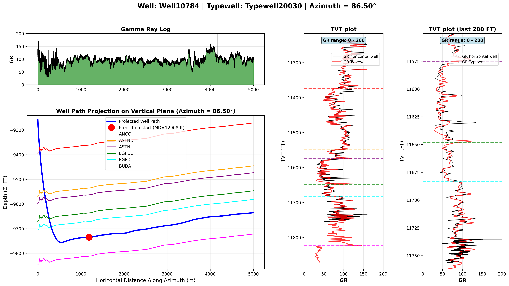

# ROGII — Wellbore Geology Prediction

> Predict where a horizontally drilled well sits within the subsurface rock layers, using only the measurements recorded along the borehole. This is the machine-learning formulation of **geosteering**, a task drilling engineers perform manually in real time.

**Competition:** [rogii-wellbore-geology-prediction](https://www.kaggle.com/competitions/rogii-wellbore-geology-prediction) · Featured · **$50,000** · deadline **2026-08-05**

---

## 1. Objective

To produce oil, a well is drilled vertically and then turned to run horizontally for thousands of feet through a sequence of rock layers. The target reservoir occupies a single thin layer, so the drilling crew must keep the bit inside it — which requires continuously knowing which layer the bit currently occupies. The competition provides this information for the early portion of each horizontal section and asks for it to be predicted across the remainder, using the measurements logged along the borehole together with a nearby vertical reference well. The sections below define those terms and explain why the prediction is non-trivial.

---

## 2. Physical setting

The subsurface is a stack of rock layers, each with distinct material properties. A horizontal well does not cross this stack vertically; it runs nearly parallel to it, threading through the layers at a shallow angle. A single sensor at the bit reports the type of rock in contact at each step, producing a continuous log as drilling advances. The subsurface is otherwise unobserved — this log is the only direct evidence of the bit's position within the layers.

The task is to determine, at every step, how deep within the layer sequence the bit lies. This is made tractable by a second well drilled vertically nearby, which penetrates the full sequence of layers and records the same rock measurement from top to bottom. That vertical record serves as a **reference profile**: a mapping from depth-in-the-rock to expected sensor reading. Matching the bit's readings against this profile recovers its depth. The remainder of this document formalizes these elements.

---

## 3. Terminology

The horizontal portion of the well is the **lateral**, and the drilling tip is the **bit**, which logs a measurement approximately every **1 foot** of advance.

- **MD** (measured depth) — distance travelled along the borehole; a monotonically increasing position index along the lateral.
- **GR** (gamma ray) — the bit's sensor reading, measuring the rock's natural radioactivity. Rock types differ in radioactivity (shale reads high, sandstone low), making GR a proxy for rock type.
- **Typewell** — the nearby vertical well. Because it penetrates the entire layer sequence, it provides GR as a function of depth for the full stack: the reference profile described above.

The quantity to be predicted is the bit's depth within the rock. Two distinct notions of depth must be separated:

- **Z** — depth in physical space (feet below sea level): a purely geometric position in the ground.
- **TVT** — depth within the rock layers (how far into the layer sequence the bit lies). This is the prediction target.

Z and TVT diverge because the layers are tilted (they *dip*). As the bit advances horizontally, it may hold a constant Z while the dipping layers pass it by, shifting it into a different layer; conversely it may change Z while remaining in the same layer. **Z describes position relative to the ground; TVT describes position relative to the rock.** In one representative well, the difference between them drifts by **~881 ft** across the lateral — a drift attributable entirely to structural dip. This is precisely why Z cannot substitute for TVT, and why TVT is the target.

This framing also explains why the typewell is usable: because TVT is measured relative to the layers, a given layer occupies the **same TVT in both wells**. The typewell's GR-versus-TVT profile and the lateral's GR readings are therefore expressed in a common reference, and aligning the latter against the former yields TVT. The lateral files carry six named layer-boundary markers (`ANCC, ASTNU, ASTNL, EGFDU, EGFDL, BUDA`, ordered top to bottom); for modeling only their ordering and GR signatures are relevant.

*Figure, left to right.* **Top-left:** the GR log along the lateral — the primary input signal. **Bottom-left:** a cross-sectional view of the well path (blue) threading between the dipping layer boundaries (colored lines); the red marker denotes the point beyond which TVT must be predicted. **Middle:** the bit's GR (red) and the typewell's GR (blue) plotted against TVT — agreement between the two indicates a correct depth alignment. **Right:** the same view restricted to the final interval.

---

## 4. Data format

Each well is provided as two CSV files, keyed by an 8-character well identifier.

**`{well}__horizontal_well.csv`** — the lateral, one row per foot:

| Column | Train | Test | Meaning |
|---|:---:|:---:|---|
| `MD` | ✓ | ✓ | Distance drilled along the borehole |
| `X`, `Y`, `Z` | ✓ | ✓ | Spatial position of the bit (`Z` = depth below sea level) |
| `GR` | ✓ | ✓ | Gamma-ray reading; rock-type proxy (contains missing values) |
| `TVT_input` | ✓ | ✓ | Known TVT for the early portion of the lateral only; blank thereafter |
| **`TVT`** | ✓ | ✗ | **Target** — depth within the rock layers at every point (training only) |
| `ANCC, ASTNU, ASTNL, EGFDU, EGFDL, BUDA` | ✓ | ✗ | Six layer-boundary depths (same six columns in every well) — **training only; these leak the target and must not be used as inputs** |

**`{well}__typewell.csv`** — the vertical reference profile:

| Column | Meaning |
|---|---|
| `TVT` | Depth within the rock layer sequence |
| `GR` | Gamma-ray reading at that depth |
| `Geology` | Named interval to which that depth belongs (43 labels total — 6 near-universal formations plus a long, rare tail; distinct from the six lateral boundary columns) |

The point at which the known values (`TVT_input`) end is the **Prediction Start (PS)**. The task is to predict `TVT` for every point from PS to the end of the lateral. Submissions take the form `id,tvt`, where `id = {well}_{rowindex}`, with one row per predicted point.

---

## 5. Why the problem is difficult

The typewell maps each depth to an expected GR reading, so the obvious approach is to take each GR reading from the lateral and look up the depth that produced the same value. This does not work. Examining why it breaks down identifies what a real solution must handle. The figures below come from one representative well.

1. **One reading is not enough to identify a depth.** The same GR value occurs at many depths throughout the stack: a reading of `GR ≈ 100` matches **159 different depths, spread across ~600 ft**. A single value barely narrows down the position. What is distinctive is the *sequence* of readings over a stretch of borehole — its pattern of rises and falls — not any individual number.

2. **The lateral's readings are stretched relative to the reference.** Because the lateral runs nearly parallel to the layers, the bit covers **~100 ft of drilling for every 1 ft of depth gained through the rock**, and that ratio changes along the well. The same geological feature that occupies a few feet in the vertical typewell is smeared across hundreds of feet in the lateral. Before the two can be compared, the lateral's signal must be compressed back onto the typewell's depth scale — by a factor that is not constant.

3. **The bit moves up and down, so a match is directionally ambiguous.** The bit's depth in the rock rises and falls along the lateral in roughly equal proportion, rather than steadily increasing. A stretch of readings can therefore match the reference equally well whether the bit was descending or ascending. The ambiguity is only resolved by requiring the predicted depth to form a smooth, continuous path.

4. **The two GR sources are not on the same scale.** The bit and the typewell use different instruments, so their readings differ in baseline and range. The numbers cannot be compared directly; one signal must first be normalized onto the other.

5. **Readings are missing, and the reference is only approximate.** Roughly **28% of the lateral's GR values are absent on a typical well (up to ~80% on the worst), and the gaps are denser *after* the Prediction Start** — exactly the interval being predicted — so the signal being matched is full of holes where it matters most. The typewell is also only a nearby well: the layers tilt and change thickness between the two locations, so its profile is a close approximation of the lateral's geology, not an exact key.

Taken together, the task is to recover a **smooth depth path** whose readings best **line up** with the typewell profile — after correcting for variable stretch, resolving direction, normalizing scale, and tolerating missing data — using the known pre-PS interval as the anchor. It is a constrained sequence-alignment problem, not a row-by-row regression.

---

## 6. Evaluation

Submissions are scored by the **root-mean-square error (RMSE)** of `predicted TVT − true TVT`, in feet, over all predicted points. The metric measures the average vertical error of the predicted in-rock position, penalizing large deviations disproportionately. Because the meaningful variation along a lateral spans only tens of feet, sub-foot improvements are material.

---

## 7. Dataset summary

- **773 training wells**, each comprising a lateral CSV, a typewell CSV, and a four-panel reference figure.
- **3 test wells are visible** (lateral + typewell CSVs only, without the target or layer-boundary columns), covering 14,151 prediction rows. This is a **code competition** (`is_kernels_submissions_only = True`): the scored test set is larger and hidden, and submissions run as a Kaggle notebook re-executed against it. The visible wells are a local smoke-test fixture.
- Each lateral contains 2,058–12,141 points (median ~6,576) at exactly 1-foot spacing. All units are in feet.
- The Prediction Start sits early: on the visible test wells, ~70–80% of each lateral lies after PS, so the prediction horizon is long.

**Known pitfalls**
- Train and test files share basenames across folders; `train/` and `test/` must be kept strictly separate when downloading.
- GR contains extended missing intervals: ~28% of points missing on a typical well (up to ~80%), and denser after the Prediction Start than before.
- The `ANCC … BUDA` columns appear only in training and leak the target; they must never be used as model inputs.
- `TVT_input` equals `TVT` exactly before the PS point — it is the known calibration interval, not an independent feature.

---

## 8. Validation plan

**Locked.** 5-fold cross-validation split by **whole wells** (GroupKFold on the well identifier), with the assignment frozen to `data/processed/cv-folds.parquet` so every model is scored on identical folds. Rows are never split within a well: consecutive rows are 1 foot apart and nearly identical, so a row-level split would let the model see the answers. Each held-out well is scored exactly the way the competition scores it — only the pre-PS interval is treated as known, predictions run from PS to the end of the lateral, and the error is the **pooled RMSE over every predicted row** across all held-out wells.

Local CV is trusted over the public leaderboard: the three visible test wells overlap the training set, and public notebooks exploit that overlap for near-oracle public scores. The private set — which decides the competition — is expected to consist of unseen wells, which is precisely what well-level CV simulates. (The flat baseline reproduces the publicly known ~15.9 score on this CV, certifying the harness end-to-end.)

---

## 9. Approach

**First attempt — geometry (refuted).** Whole-well analysis suggested `TVT ≈ −Z + D` with `D` a small smooth residual, implying TVT could ride the freely available `Z` for most of its motion. Baselines built on this collapsed (B2/B3 below): the lockstep between TVT and Z exists only in the steep descent section, which is never scored. In the scored horizontal section the driller steers to hold the bit *inside* the target layer, so TVT barely moves (~26 ft median excursion) while Z absorbs the layers' structural relief (~6× larger swings) — the whole-well correlation of 0.92 falls to 0.09, and nothing about the coupling measured on the drilled section carries over past PS (slope transfer ≈ 0). The full post-mortem with corrected statistics is in [`notebooks/eda/03-eda-post-ps.ipynb`](notebooks/eda/03-eda-post-ps.ipynb).

**Current direction — sequence alignment.** The same analysis shows the deviation to predict is a smooth, bounded wander (±~50 ft worst case, direction persisting ~170 ft at a time but not extrapolable), and that the GR log — despite ~30% missingness — has mostly 1-ft pinhole gaps: bridging holes of ≤5 ft yields unbroken stretches of 1,000+ ft. The model under development therefore starts from the flat prediction and bends it, smoothly, wherever the lateral's GR sequence matched against the typewell's depth-vs-GR profile indicates the bit has drifted within the rock — anchored at PS, with continuity enforced as a hard constraint.

---

## 10. Results

One row per milestone; negative results stay visible — they are what justified the approach pivot.

| Milestone | Local CV (RMSE ft) | Public LB | Private LB | Note |
|---|---|---|---|---|
| **B1 — flat carry-forward** | **15.91** | — | — | current best; the floor to beat |
| B2 — geometry, −Z + offset | 107.49 | — | — | refuted (see §9) |
| B3 — geometry, + fitted dip | 73.08 | — | — | refuted (see §9) |

---

## 11. Reproduction

> 🚧 **Pending.** Environment, data-retrieval commands, and `src/` entry points documented as the pipeline is implemented.

---

## 12. Key takeaways

> 🚧 **Pending.** Recorded at the conclusion of the run.
